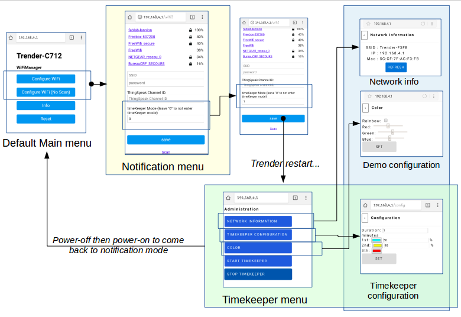
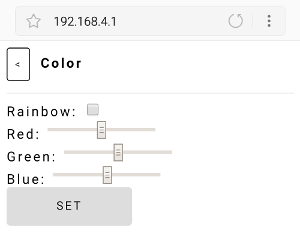
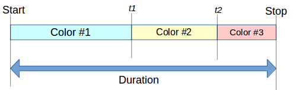

Trender
=======

> "It is during our darkest moments that we must focus to see the light." Aristote

The Trender is an objet translating different types of information into light.

*Read this in other languages: [English](trender.md), [Français](trender.fr.md), [Brezhoneg](trender.bzh.md)*

## Table of Contents
  - [Get started](#get-started)
  - [Modes](#modes)
    - [Demo](#demo)
    - [Timekeeper](#time-keeper)
    - [Notification](#notification)
  - [FAQ](#faq)

## Get started
The procedure to setup your Trender is:
  * Connect your Trender to a power supply through the USB cable, a light cycle will start to indicate that the Trender is properly powered.
  * From your mobile phone or your computer, select the WiFi network whith SSID starting with TRENDER-
  * If the pop-up connection window is not automatically displayed, open a web browser and enter the url http://192.168.4.1

You should see the following screen:

 1. Configure WiFi
 2. Configure WiFi (No Scan)
 3. Info
 4. Reset

### Configure WiFi

The "Configure WiFi" menu allows to connect the Trender to the Web as well as the ThingSpeak channel for the Notification mode.
The Trender will connect automatically if it has been already configured and if the network is reachable.
It is possible to scan all the access points.

### Configure WiFi (No Scan)

The "Configure WiFi (No scan)" menu can be used to configure only the ThingSpeack channel.

### Info

This menu provides Trender physical information (Chip ID, IP Address, MAC, ...).

### Reset

This menu can be used to perform a factory reset. **Be careful! All the previous parameters
(especially the WiFi configuration) will be cleaned.**

## Modes

The Trender supports several modes. You can use it as:
 * Demo
 * Timekeeper
 * Notification system (twitter, jenkins)

By default the Trender is in Notification mode.

You can switch from Notification to Timekeeper mode by putting *1* in the mode
window of the **Configure WiFi** menu.
A green light will blink to indicate that the mode has been changed.
The trender will restart and a new page will be displayed on the http://192.168.4.1.

Once in timekeeper mode, you may come back to notification after Trender power restart.

### Demo

The Demo mode can be started from the Timekeeper menu.
Select the submenu **Color** then tick **rainbow** or choose the color you want.

### Timekeeper

A timekeeper is often referred to as a time clock, which tracks time. The
Trender allows to set 3 fully customizable thresholds.

From the WiFi configure menu, once you set *1* in the mode window, come back to
the main page. A new menu will be displayed.

You can:
  * Cutomize your timekeeper
  * Start your timekeeper
  * Stop your timekeeper
  * Get network info
  * Start the Demo mode

Select the menu **TIMEKEEPER CONFIGURATION**

#### Configuration

You can configure:
 * the duration
 * 3 intermediate steps

The duration and different timers can be defined as follows:

### Notification

The Trender may translate web information into light.
You must configure a web public access point. You must select the SSID and
enter the password. Then you must select the ThingSpeak channel ID https://thingspeak.com/.

#### Configuration
TODO

## FAQ
